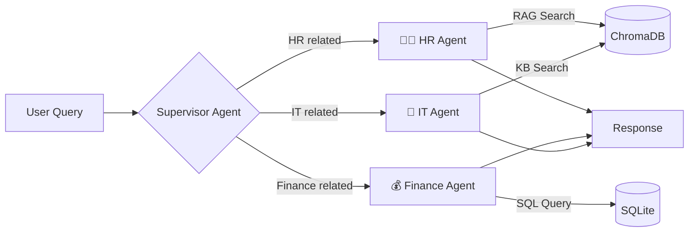

<div align="center">

# 🤖 Multi-Agent Enterprise AI Assistant

### A production-quality Proof of Concept demonstrating Agentic AI orchestration

[](https://python.org)
[](https://nextjs.org)
[](https://langchain-ai.github.io/langgraph/)
[](https://fastapi.tiangolo.com)
[](https://flask.palletsprojects.com)
[](https://typescriptlang.org)
[](https://tailwindcss.com)
[](https://opensource.org/licenses/MIT)

<br/>

**A modern enterprise AI platform featuring a Supervisor-Worker multi-agent architecture, built with LangGraph for intelligent task routing across specialized HR, Finance, and IT Support agents.**

[Features](#-features) · [Architecture](#-architecture) · [Tech Stack](#-tech-stack) · [Getting Started](#-getting-started) · [API Reference](#-api-reference) · [Roadmap](#-roadmap)

</div>

---

## ✨ Features

<table>
<tr>
<td width="50%">

### 🧠 Intelligent Agent Orchestration
- **Supervisor Agent** intelligently routes queries to the right specialist
- **HR Agent** — RAG-powered search over company policies & benefits
- **Finance Agent** — Text-to-SQL queries on budget and expense data
- **IT Support Agent** — Knowledge base search for troubleshooting

</td>
<td width="50%">

### 🎨 Premium Enterprise UI
- Modern chat interface with real-time responses
- Framer Motion animations & micro-interactions
- Fully responsive design (mobile → desktop)
- Dark mode-ready with glassmorphism elements

</td>
</tr>
<tr>
<td width="50%">

### ⚡ Hybrid Backend Architecture
- **FastAPI** handles async routes & auto-generates OpenAPI docs
- **Flask** mounted via WSGIMiddleware for synchronous agent processing
- Unified server running on a single port
- Production-ready CORS configuration

</td>
<td width="50%">

### 🗃️ Dual Data Layer
- **SQLite** for structured financial data (budgets, expenses)
- **ChromaDB** for vector search over HR policies & IT docs
- Pre-built seed scripts for instant synthetic data generation
- Zero external database dependencies

</td>
</tr>
</table>

---

## 🏗️ Architecture

### System Overview

```
┌─────────────────────────────────────────────────────────────────┐
│                        CLIENT (Browser)                        │
│                  Next.js 15 · React · Tailwind                 │
│              shadcn/ui · Framer Motion · Zustand               │
└──────────────────────────┬──────────────────────────────────────┘
                           │ REST API (HTTP)
                           ▼
┌─────────────────────────────────────────────────────────────────┐
│                    HYBRID API SERVER                            │
│            FastAPI (ASGI) + Flask (WSGI Mounted)                │
│                   Uvicorn · Port 8000                           │
├─────────────────────────────────────────────────────────────────┤
│                                                                 │
│  ┌───────────────────────────────────────────────────────────┐  │
│  │              🧠 LangGraph Orchestration                   │  │
│  │                                                           │  │
│  │   ┌─────────────┐     Routes to      ┌──────────────┐    │  │
│  │   │  Supervisor  │ ──────────────────▶│   HR Agent   │    │  │
│  │   │    Agent     │                    │  (RAG Tools) │    │  │
│  │   │   (Router)   │                    └──────────────┘    │  │
│  │   │             │                    ┌──────────────┐    │  │
│  │   │             │ ──────────────────▶│Finance Agent │    │  │
│  │   │             │                    │ (SQL Tools)  │    │  │
│  │   │             │                    └──────────────┘    │  │
│  │   │             │                    ┌──────────────┐    │  │
│  │   │             │ ──────────────────▶│  IT Agent    │    │  │
│  │   │             │                    │  (KB Search) │    │  │
│  │   └─────────────┘                    └──────────────┘    │  │
│  └───────────────────────────────────────────────────────────┘  │
│                                                                 │
├──────────────────────┬──────────────────────────────────────────┤
│   📊 SQLite          │           🔍 ChromaDB                    │
│   Budgets · Expenses │           HR Policies · IT Guides        │
└──────────────────────┴──────────────────────────────────────────┘
```

### Agent Routing Flow



---

## 🛠️ Tech Stack

| Layer | Technology | Purpose |
|-------|-----------|---------|
| **Frontend** | Next.js 15, React, TypeScript | App framework & type safety |
| **Styling** | Tailwind CSS 4, shadcn/ui | Utility-first CSS & component library |
| **Animations** | Framer Motion | Smooth micro-interactions |
| **State** | Zustand | Lightweight state management |
| **Backend (ASGI)** | FastAPI | Async routes & OpenAPI docs |
| **Backend (WSGI)** | Flask | Synchronous agent processing |
| **Orchestration** | LangGraph | Multi-agent state machine |
| **LLM Framework** | LangChain | Tools, prompts & model abstraction |
| **LLM Provider** | Gemini 1.5 Pro / OpenAI | Language model inference |
| **Structured DB** | SQLite | Financial data storage |
| **Vector DB** | ChromaDB | Document embeddings & similarity search |

---

## 📁 Project Structure

```
Multi-Agent-Enterprise-AI-Assistant/
│
├── backend/                          # Python Backend
│   ├── app/
│   │   ├── agents/
│   │   │   ├── graph.py              # LangGraph state machine & supervisor
│   │   │   └── worker_agents.py      # HR, Finance, IT agent definitions
│   │   ├── api/                      # Additional API route modules
│   │   ├── core/                     # App configuration & settings
│   │   ├── db/
│   │   │   ├── database.py           # SQLite connection & session
│   │   │   └── vectorstore.py        # ChromaDB client & collections
│   │   ├── models/                   # SQLAlchemy & Pydantic models
│   │   ├── tools/
│   │   │   ├── rag_tools.py          # Vector search tools (HR & IT)
│   │   │   └── sql_tools.py          # SQL query tool (Finance)
│   │   ├── utils/                    # Helper functions
│   │   └── main.py                   # FastAPI + Flask hybrid entry point
│   ├── data/
│   │   └── seed_data.py              # Synthetic data generation script
│   └── requirements.txt
│
├── frontend/                         # Next.js Frontend
│   ├── src/
│   │   ├── app/
│   │   │   ├── globals.css           # Global styles & Tailwind config
│   │   │   ├── layout.tsx            # Root layout with Inter font
│   │   │   └── page.tsx              # Main chat interface
│   │   ├── components/ui/            # shadcn/ui components
│   │   ├── hooks/                    # Custom React hooks
│   │   ├── lib/                      # Utility functions
│   │   └── store/
│   │       └── useChatStore.ts       # Zustand chat state management
│   ├── package.json
│   └── tailwind.config.ts
│
├── .gitignore
└── README.md
```

---

## 🚀 Getting Started

### Prerequisites

- **Python 3.11+**
- **Node.js 18+**
- **Gemini API Key** or **OpenAI API Key**

### 1. Clone the Repository

```bash
git clone https://github.com/Sonu-Thomas-001/Multi-Agent-Enterprise-AI-Assistant.git
cd Multi-Agent-Enterprise-AI-Assistant
```

### 2. Set Up the Backend

```bash
cd backend

# Create and activate virtual environment
python -m venv venv

# Windows
.\venv\Scripts\Activate.ps1

# macOS / Linux
source venv/bin/activate

# Install dependencies
pip install -r requirements.txt
```

### 3. Configure Environment Variables

Create a `.env` file in the `backend/` directory:

```env
# Choose one:
GEMINI_API_KEY=your_gemini_api_key_here
# OR
OPENAI_API_KEY=your_openai_api_key_here
```

### 4. Seed Synthetic Data

```bash
python data/seed_data.py
```

This populates SQLite with financial data and ChromaDB with HR policies and IT guides.

### 5. Start the Backend Server

```bash
uvicorn app.main:app --reload --port 8000
```

The API will be available at `http://localhost:8000` with auto-generated docs at `http://localhost:8000/docs`.

### 6. Set Up & Start the Frontend

```bash
cd ../frontend

# Install dependencies
npm install

# Start the development server
npm run dev
```

Visit **http://localhost:3000** and start chatting! 🎉

---

## 📡 API Reference

| Method | Endpoint | Description |
|--------|----------|-------------|
| `GET` | `/api/v1/system/status` | Health check (FastAPI) |
| `POST` | `/api/v1/chat/invoke` | Send a message to the agent system (Flask) |
| `GET` | `/docs` | Interactive Swagger documentation (FastAPI) |

### `POST /api/v1/chat/invoke`

**Request Body:**
```json
{
  "session_id": "unique-session-uuid",
  "message": "What is our Q3 marketing budget?"
}
```

**Response:**
```json
{
  "response": "The Q3 marketing budget is $200,000.",
  "agent_used": "LangGraph Supervisor",
  "sources": []
}
```

---

## 💬 Example Queries

| Domain | Example Query |
|--------|--------------|
| 🧑‍💼 **HR** | *"What is the remote work policy?"* |
| 🧑‍💼 **HR** | *"Tell me about health benefits for 2024."* |
| 💰 **Finance** | *"What is the Q3 marketing budget?"* |
| 💰 **Finance** | *"Show me Engineering department expenses."* |
| 🔧 **IT** | *"I can't connect to the VPN, help!"* |
| 🔧 **IT** | *"How do I reset my password?"* |

---

## 🗺️ Roadmap

- [x] Supervisor-Worker agent architecture with LangGraph
- [x] RAG tools for HR & IT knowledge base (ChromaDB)
- [x] Text-to-SQL tools for financial queries (SQLite)
- [x] Modern Next.js 15 chat UI with animations
- [x] Hybrid FastAPI + Flask backend
- [x] Synthetic enterprise data seeding
- [ ] Streaming responses (Server-Sent Events)
- [ ] Authentication & session persistence
- [ ] Agent memory & conversation context
- [ ] Docker Compose deployment
- [ ] Additional agents (Legal, Project Management)
- [ ] Dashboard with analytics & agent activity metrics

---

## 🤝 Contributing

Contributions are welcome! Feel free to open an issue or submit a pull request.

1. Fork the repository
2. Create your feature branch (`git checkout -b feature/amazing-feature`)
3. Commit your changes (`git commit -m 'feat: add amazing feature'`)
4. Push to the branch (`git push origin feature/amazing-feature`)
5. Open a Pull Request

---

## 📄 License

This project is licensed under the MIT License — see the [LICENSE](LICENSE) file for details.

---

<div align="center">

**Built with ❤️ by [Sonu Thomas](https://github.com/Sonu-Thomas-001)**

⭐ Star this repo if you found it helpful!

</div>
